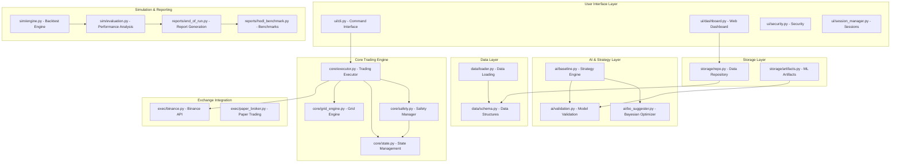

# 🤖 **Py-Binance-Bot**: Cryptocurrency Trading Bot

A sophisticated, enterprise-grade AI-powered cryptocurrency trading bot built with Python. This system combines advanced grid trading strategies, machine learning optimization, and comprehensive risk management to deliver professional-level automated trading capabilities for the Binance exchange.

## ✨ **Features**

- **🔗 Grid Trading**: Automated grid trading with manual and AI-assisted parameter optimization
- **🧠 Machine Learning**: Bayesian optimization for strategy parameter tuning
- **🛡️ Risk Management**: Multi-layer safety systems with circuit breakers and position limits
- **📊 Data Management**: Efficient data loading with Parquet caching and validation
- **🖥️ Web Interface**: Real-time monitoring dashboard and command-line interface
- **🔐 Secure Storage**: Encrypted credential management and hybrid data persistence
- **📈 Backtesting**: Comprehensive strategy testing with walk-forward validation

## 🏗️ **Architecture Overview**



## 🏗️ **System Architecture**

This trading bot is built with a modular, enterprise-grade architecture that separates concerns and ensures reliability, testability, and maintainability.

```bash
py-binance-bot/
├── 🎯 core/                    # Core Trading Engine
│   ├── executor.py             # Main trading execution coordinator
│   ├── safety.py               # Risk management & circuit breakers
│   ├── sizing.py               # Position sizing & fee calculations
│   ├── flatten.py              # Emergency position flattening
│   ├── grid_engine.py          # Grid trading strategy engine
│   └── state.py                # State persistence & management
├── 🔌 exec/                    # Exchange Interface Layer
│   ├── binance.py              # Binance API client with retry logic
│   ├── rate_limit.py           # Smart rate limiting & request throttling
│   └── paper_broker.py         # Paper trading simulation
├── 🤖 ai/                      # AI & Machine Learning
│   ├── baseline.py             # Technical indicators & baseline strategies  
│   ├── bo_suggester.py         # Bayesian optimization for hyperparameters
│   ├── validation.py           # Model validation & walk-forward analysis
│   └── README.md               # AI module documentation
├── 📊 data/                    # Data Management
│   ├── loader.py               # Historical data fetching & caching
│   └── schema.py               # Data models & validation schemas
├── 🧪 sim/                     # Simulation & Backtesting
│   ├── engine.py               # Backtesting simulation engine
│   ├── evaluation.py           # Performance metrics & analysis
│   └── slippage.py             # Realistic slippage modeling
├── 💾 storage/                 # Data Persistence
│   ├── artifacts.py            # Model & config artifact management
│   └── repo.py                 # Data repository layer
├── 📈 reports/                 # Analytics & Reporting
│   ├── end_of_run.py           # Comprehensive trading reports
│   └── hodl_benchmark.py       # Buy-and-hold benchmark comparison
├── 🖥️ ui/                      # User Interface
│   ├── cli.py                  # Command-line interface
│   └── dashboard.py            # Web dashboard (future)
├── 🧪 tests/                   # Comprehensive Test Suite (167+ tests)
│   ├── test_safety.py          # Risk management tests (78% coverage)
│   ├── test_executor.py        # Trading execution tests
│   ├── test_sizing.py          # Position sizing tests (86% coverage)
│   ├── test_rate_limiting.py   # Rate limiting tests (69% coverage)
│   ├── test_binance_client.py  # API client tests (68% coverage)
│   ├── test_safety_clean.py    # Additional safety system tests
│   └── test_executor_simple.py # Simplified executor tests
├── main.py                     # Application entry point
├── config.py                   # Configuration management
├── GLOSSARY.md                 # Technical terms and definitions
└── requirements.txt            # Python dependencies
```

## 📦 Installation

### 📋 Requirements

- **Python 3.10+**: Modern Python version for optimal performance
- **API Access**: Binance account with API credentials (or compatible exchange)
- **Optional**: GPU for accelerated ML training and optimization

### 🚀 Setup

1. **Clone the repository**:
```bash
git clone https://github.com/michaelandrewrm/py-binance-bot.git
cd py-binance-bot
```

2. **Set up virtual environment**:
```bash
# Create virtual environment
python -m venv trading_bot_env

# Activate (Linux/macOS)
source trading_bot_env/bin/activate

# Activate (Windows)
trading_bot_env\Scripts\activate
```

3. **Install dependencies**:
```bash
pip install -r requirements.txt
# Or for minimal installation
pip install -r requirements-minimal.txt
```

4. **Configure credentials**:
```bash
python -m ui.cli config init
```

```bash
python -m ui.cli config show
```

5. **Validate configuration**:
```bash
python -m ui.cli config validate
```

## 🚀 Quick Start

### 📝 Paper Trading (Recommended for beginners)

Start with risk-free paper trading to familiarize yourself with the system:

```bash
# Start grid trading with manual parameters
python -m ui.cli grid start BTCUSDC --mode manual

# Check trading status
python -m ui.cli grid status

# View dashboard
python -m ui.dashboard
```

### 💰 Live Trading (Advanced users)

⚠️ **Warning**: Only proceed with live trading after thorough testing in paper mode.

```bash
# AI-assisted parameter selection
python -m ui.cli grid start BTCUSDC --mode ai --confirm-live

# Monitor with web dashboard
streamlit run ui/dashboard.py
```

### 📊 Backtesting

Test and optimize your strategies using historical data:

```bash
# Run backtest on historical data
python -m ui.cli backtest run --strategy grid --symbol BTCUSDC --days 30

# Optimize parameters
python -m ui.cli model optimize --strategy baseline --symbol BTCUSDC
```

## 📁 Directory Structure

The following table provides an overview of the project's modular architecture:

| Directory | Purpose | Key Features |
|-----------|---------|--------------|
| [`🤖 ai/`](ai/README.md) | Machine learning and strategy intelligence | Bayesian optimization, baseline strategies, model validation |
| [`🎯 core/`](core/README.md) | Core trading infrastructure | Trading executor, safety systems, grid engine, state management |
| [`📊 data/`](data/README.md) | Data structures and loading | Market data schemas, caching, validation |
| [`🔌 exec/`](exec/README.md) | Exchange integration | Binance API client, paper trading, rate limiting |
| [`📈 reports/`](reports/README.md) | Performance analysis and reporting | Comprehensive reports, HODL benchmarks, chart generation |
| [`🧪 sim/`](sim/README.md) | Backtesting and simulation | Event-driven backtesting, performance evaluation, slippage models |
| [`💾 storage/`](storage/README.md) | Data persistence and ML artifacts | SQLite repository, ML model storage, hybrid data management |
| [`🖥️ ui/`](ui/README.md) | User interfaces | CLI, web dashboard, session management, security |

## ⚙️ Configuration

### 🌍 Environment Variables

Create a `.env` file in the project root with your API credentials:

```bash
# API Configuration
BINANCE_API_KEY=your_api_key_here
BINANCE_API_SECRET=your_api_secret_here
BINANCE_TESTNET=true  # Use testnet for testing
```

Update the `config.yaml` file with your trading preferences:

```yaml
trading:
    default_symbol: "BTCUSDC"
    default_timeframe: "5m"
    max_position_size: 1000.0
    risk_per_trade: 0.02

grid:
    n_grids: 12
    invest_per_grid: 50.0
    grid_spacing_pct: 0.01
    upper_price: null
    lower_price: null
```

### 🛡️ Risk Management

Configure risk limits in the `risk_limits.json` file to protect your capital:

```json
{
    "max_daily_loss": 100.0,
    "max_position_size": 1000.0,
    "max_open_orders": 20,
    "circuit_breaker_threshold": 0.05
}
```

## 🛡️ Safety Features

The trading bot includes multiple layers of protection to safeguard your investments:

- **🚨 Multi-layer Risk Management**: Position limits, daily loss limits, and automated circuit breakers
- **⚡ Emergency Flatten**: Instant position closure with `python -m ui.cli trade flatten`
- **📝 Paper Trading Default**: All operations default to paper trading mode for safety
- **💾 State Persistence**: Automatic state saving and recovery for system continuity
- **✅ Input Validation**: Comprehensive validation of all user inputs and commands

## 🛠️ Development

### 🧪 Running Tests

Ensure code quality and reliability with our comprehensive test suite:

```bash
# Run all tests
python -m pytest

# Run specific test category
python -m pytest tests/test_core/

# Run with coverage
python -m pytest --cov=. --cov-report=html
```

### 🔍 Code Quality

Maintain high code standards with automated tools:

```bash
# Format code
python -m black .

# Type checking
python -m mypy .

# Linting
python -m flake8 .
```

## 📚 Documentation

- **👨‍💻 [Developer Docs](DEVELOPER_DOCS.md)**: Detailed API documentation and development guides
- **📖 [Full Glossary](GLOSSARY.md)**: Complete terminology reference for trading and technical terms
- **📁 Directory READMEs**: See individual directory documentation for module-specific information

## 🤝 Contributing

We welcome contributions from the community! To contribute:

1. **Fork the repository** on GitHub
2. **Create a feature branch**: `git checkout -b feature-name`
3. **Make your changes** and add comprehensive tests
4. **Run the test suite**: `python -m pytest` to ensure everything works
5. **Submit a pull request** with a clear description of your changes

## 📄 License

This project is licensed under the MIT License - see the [LICENSE](LICENSE) file for details.

## ⚠️ Disclaimer

**This software is for educational and research purposes only. Cryptocurrency trading involves significant financial risk. The authors are not responsible for any financial losses incurred through the use of this software. Always test thoroughly with paper trading before using real funds.**

## 🆘 Support

- **🐛 Issues**: Report bugs and feature requests on [GitHub Issues](https://github.com/michaelandrewrm/py-binance-bot/issues)
- **📖 Documentation**: See directory-specific READMEs for detailed information
- **🔒 Security**: Report security vulnerabilities privately to the maintainers
